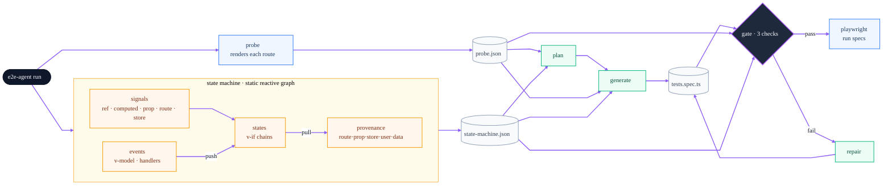

# e2e-agent

Generates Playwright E2E tests for a Vue/Nuxt SPA by grounding an LLM in two
deterministic sources of truth — a **live browser probe** and a **parsed state
machine** — then gating the output with static checks before it is allowed to land.

No invented selectors. No hand-maintained component registry. The agent only
asserts what the real app renders.

> Proven on the bundled `example/` app: `probe → statemachine → plan → generate → gate`
> passes the gate, and the generated spec runs **23/23 green** in Playwright.

---

## How it works

One CLI command runs the whole pipeline. The **probe** (blue) captures the live DOM;
the **reactive-graph state machine** (amber) is the heart — it statically reifies each
SFC into signals, events and states; the **LLM** stages (green) only reason over that
ground truth; the **gate** (◆) is a hard boundary with a bounded repair loop. Every
node is a light island, so the arrows stay readable in GitHub light *and* dark mode.



| Stage | Kind | What happens (technical) |
|---|---|---|
| **adapter** | deterministic | Maps each route → URL path + the `.vue` SFC it renders, plus monorepo import `aliases`. |
| **probe** | deterministic | Launches Chromium, navigates every hash route, waits for the SPA to mount, reads the **live DOM**: every `data-testid`, its own text, forms, headings, HTTP status. A raw HTTP GET can't do this — a SPA shell has no rendered selectors. |
| **statemachine** | deterministic | Statically reifies each SFC into a **typed reactive graph** — signals (`ref/computed/prop/route/store`, classified by import provenance via ts-morph) + events (`v-model`/handlers). Each state's **provenance** is a PULL (backward slice to source kind); the actuators that flip it are a PUSH (dirty-mark). Forms link field↔error by symbol; contracts auto-derived. Zero AI, **zero keyword matching** — see [docs/foundations.md](docs/foundations.md). |
| **plan** | Claude | Turns the scenario checklist into a human-reviewable `test-plan.md`, grounded by probe selectors. |
| **generate** | Claude | Writes `tests.spec.ts` from plan + probe + state machine. Selectors must come from ground truth; mutual-exclusivity and submit-gating come from the state machine; exact values come from the probe. |
| **gate** | deterministic | Three static checks (below). On failure, a bounded **repair** loop (≤2) feeds the failures back to Claude. |
| **playwright** | deterministic | Runs the generated specs — and only those — from `test/integration/__playwright`. |

---

## The state machine — a static reactive graph, not keywords

The probe sees only the *default-rendered* state of a route. The state machine
enumerates **every reachable state** by statically reifying the SFC's reactive graph
(the runtime structure Vue/Shiny build dynamically — we build it total, for coverage).
Nodes are typed **signals** vs **events**; everything else is a graph traversal, never
a string match against domain words like `search`/`result`/`errors.`. Full grounding in
[docs/foundations.md](docs/foundations.md).

- **Provenance = a PULL (backward slice).** A state's trigger is found by tracing its
  guard's symbols to their source kind → `route | prop | store | user-input | data`.
  `BookView`'s form is `route` (computed from `route.params`), not a guessed "user-action".
- **Transitions = a PUSH (dirty-mark).** "How to reach a state" falls out of the actuator
  whose signal reaches the guard. **The old "search/filter" detector is gone** — it
  *emerges*: `search-input` `v-model`→`query`, `results` computed reads `query`, the
  `v-for` reads `results`. No `['filter','search','query']` list anywhere.
- **Mutual exclusivity by chain.** Only states in one `v-if/else-if/else` chain are
  alternatives; independent `v-if`s can co-render, so neither is asserted absent.
- **Forms by symbol correlation.** A field↔error link is the error guard reading the
  *same symbol* the field binds — no `errors.(\w+)` regex, no library-name matching.
- **Literal labels.** Static text around interpolations (`Name: {{ x }}` → `"Name:"`) is
  captured so the generator asserts `Name: Alice`, not a guessed `Alice`.

## Auto-derived component contracts — no manifest

A hand-maintained "52-component" state table is fine for a demo and unmaintainable
in a real monorepo. Instead, each component's contract is **auto-found**:

1. **Conventions** — a small, stable prop→state vocabulary (`disabled`, `loading`,
   `error`, `variant`, …) read from the props bound at the call site. Works for a
   DS primitive *and* a custom Pinia wrapper alike.
2. **SFC discovery** — if the component's source resolves (relative import, or a
   configured workspace `alias`), its own `.vue` is parsed: its internal `v-if`
   branches and its children's state props become contract states.

Opaque externals degrade to convention-only; adding a workspace alias upgrades
them to SFC-derived. The design scales by configuration, not by editing a table.

## The gate — three deterministic checks

| Check | Asserts | Notably |
|---|---|---|
| **Plan coverage** | every planned `### ID` scenario is coded | allows splitting one scenario into several tests |
| **Assertion density** | every `test()` has a value assertion | `toBeVisible`/`toBeTruthy` alone fails |
| **Selector validity** | every `getByTestId(...)` exists in probe ∪ state machine | **quote-agnostic** — single-quoted selectors can't bypass it |

---

## Quickstart

```bash
yarn install
yarn playwright install chromium

# terminal 1 — run the example SPA
yarn example:dev                 # http://localhost:5173

# terminal 2 — generate + gate against it
export ANTHROPIC_API_KEY=sk-...  # or a .env file (gitignored)
yarn run --base-url http://localhost:5173

# run the generated specs
yarn playwright test
```

Individual stages: `yarn probe`, `yarn statemachine`, `yarn plan`, `yarn generate`, `yarn gate`.

All artifacts are written to `test/integration/__playwright/`, which is also the
only directory Playwright is configured to run.

---

## Layout

```
src/
  cli/                     commander entry (probe · statemachine · plan · generate · gate · run)
  run.ts                   pipeline orchestrator + repair loop
  core/                    types, constants, output sanitizer
  adapters/vue-demo/       route → SFC map + monorepo aliases
  generators/              Anthropic SDK wrapper (swap for Bedrock here)
  rules/                   composable raw rule strings for the prompts
  orchestrators/
    probe/                 Playwright DOM probe
    state-machine/         parse-template · parse-forms · parse-script (ts-morph)
                           conventions · derive-contract · scenarios · summarize
    plan/ generate/ gate/ repair/
example/                   Vue 3 + Pinia + vue-router target SPA (hash routing)
test/integration/__playwright/   generated artifacts + the specs Playwright runs
```

## Targeting your own app

Add an adapter: list each route's `path` + `sfc`, and (for a monorepo) the import
`aliases` that point component specifiers at their source. Everything downstream —
probe, state machine, contracts, gate — is app-agnostic.

## Code style

ESLint (flat config): no semicolons, no dangling commas, space before the function
declaration paren. `yarn lint` / `yarn lint:fix`.
