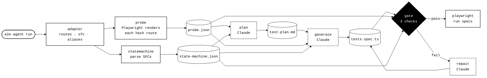

# e2e-agent

Generates Playwright E2E tests for a Vue/Nuxt SPA by grounding an LLM in two
deterministic sources of truth — a **live browser probe** and a **parsed state
machine** — then gating the output with static checks before it is allowed to land.

No invented selectors. No hand-maintained component registry. The agent only
asserts what the real app renders.

> Proven on the bundled `example/` app: `probe → statemachine → plan → generate → gate`
> passes the gate, and the generated spec runs **23/23 green** in Playwright.

---

## How it works

From the CLI, one command runs the whole pipeline. Deterministic stages
(white) build the ground truth; the LLM stages (dashed) only reason over it;
the gate (◆) is a hard quality boundary with a bounded repair loop.



| Stage | Kind | What happens (technical) |
|---|---|---|
| **adapter** | deterministic | Maps each route → URL path + the `.vue` SFC it renders, plus monorepo import `aliases`. |
| **probe** | deterministic | Launches Chromium, navigates every hash route, waits for the SPA to mount, reads the **live DOM**: every `data-testid`, its own text, forms, headings, HTTP status. A raw HTTP GET can't do this — a SPA shell has no rendered selectors. |
| **statemachine** | deterministic | Parses each SFC into a state graph: `v-if/else-if/else` chains (`parse-template`), VeeValidate forms + field→error + submit gating (`parse-forms`), computeds/imports/props/stores via a **ts-morph AST** (`parse-script`), auto-derived component contracts (`derive-contract`), and a synthesized scenario checklist. Zero AI. |
| **plan** | Claude | Turns the scenario checklist into a human-reviewable `test-plan.md`, grounded by probe selectors. |
| **generate** | Claude | Writes `tests.spec.ts` from plan + probe + state machine. Selectors must come from ground truth; mutual-exclusivity and submit-gating come from the state machine; exact values come from the probe. |
| **gate** | deterministic | Three static checks (below). On failure, a bounded **repair** loop (≤2) feeds the failures back to Claude. |
| **playwright** | deterministic | Runs the generated specs — and only those — from `test/integration/__playwright`. |

---

## The state machine — ground truth, not guesswork

The probe sees only the *default-rendered* state of a route. The state machine
enumerates **every reachable state**, so the generator knows about selectors and
branches a direct navigation can never reach (e.g. the confirmed-booking view).
Three correctness properties it guarantees:

- **Mutual exclusivity by chain.** Only states in the same `v-if/v-else-if/v-else`
  chain are alternatives. Independent `v-if="featured"` and `v-if="seats > 0"`
  blocks can co-render, so neither is asserted absent when the other shows.
- **Precise filter detection.** A search filter is a real bound input (a parsed
  form field), not any testid that merely contains the word "search".
- **Literal labels.** Static text around interpolations (`Name: {{ x }}` → `"Name:"`)
  is captured so the generator asserts `Name: Alice`, not a guessed `Alice`.

## Auto-derived component contracts — no manifest

A hand-maintained "52-component" state table is fine for a demo and unmaintainable
in a real monorepo. Instead, each component's contract is **auto-found**:

1. **Conventions** — a small, stable prop→state vocabulary (`disabled`, `loading`,
   `error`, `variant`, …) read from the props bound at the call site. Works for a
   DS primitive *and* a custom Pinia wrapper alike.
2. **SFC discovery** — if the component's source resolves (relative import, or a
   configured workspace `alias`), its own `.vue` is parsed: its internal `v-if`
   branches and its children's state props become contract states.

Opaque externals degrade to convention-only; adding a workspace alias upgrades
them to SFC-derived. The design scales by configuration, not by editing a table.

## The gate — three deterministic checks

| Check | Asserts | Notably |
|---|---|---|
| **Plan coverage** | every planned `### ID` scenario is coded | allows splitting one scenario into several tests |
| **Assertion density** | every `test()` has a value assertion | `toBeVisible`/`toBeTruthy` alone fails |
| **Selector validity** | every `getByTestId(...)` exists in probe ∪ state machine | **quote-agnostic** — single-quoted selectors can't bypass it |

---

## Quickstart

```bash
yarn install
yarn playwright install chromium

# terminal 1 — run the example SPA
yarn example:dev                 # http://localhost:5173

# terminal 2 — generate + gate against it
export ANTHROPIC_API_KEY=sk-...  # or a .env file (gitignored)
yarn run --base-url http://localhost:5173

# run the generated specs
yarn playwright test
```

Individual stages: `yarn probe`, `yarn statemachine`, `yarn plan`, `yarn generate`, `yarn gate`.

All artifacts are written to `test/integration/__playwright/`, which is also the
only directory Playwright is configured to run.

---

## Layout

```
src/
  cli/                     commander entry (probe · statemachine · plan · generate · gate · run)
  run.ts                   pipeline orchestrator + repair loop
  core/                    types, constants, output sanitizer
  adapters/vue-demo/       route → SFC map + monorepo aliases
  generators/              Anthropic SDK wrapper (swap for Bedrock here)
  rules/                   composable raw rule strings for the prompts
  orchestrators/
    probe/                 Playwright DOM probe
    state-machine/         parse-template · parse-forms · parse-script (ts-morph)
                           conventions · derive-contract · scenarios · summarize
    plan/ generate/ gate/ repair/
example/                   Vue 3 + Pinia + vue-router target SPA (hash routing)
test/integration/__playwright/   generated artifacts + the specs Playwright runs
```

## Targeting your own app

Add an adapter: list each route's `path` + `sfc`, and (for a monorepo) the import
`aliases` that point component specifiers at their source. Everything downstream —
probe, state machine, contracts, gate — is app-agnostic.

## Code style

ESLint (flat config): no semicolons, no dangling commas, space before the function
declaration paren. `yarn lint` / `yarn lint:fix`.
